

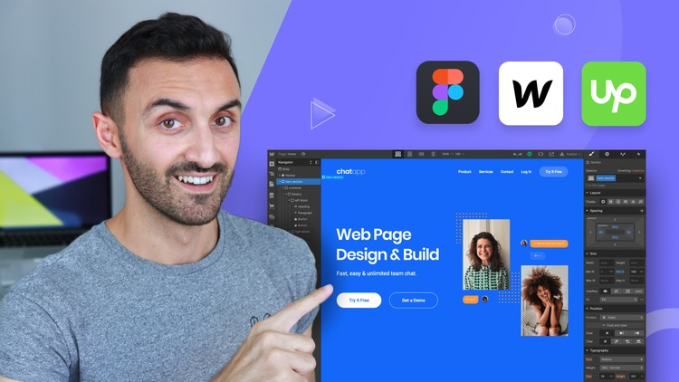

# Web Design workshop

This course I will learn about wed design and how to create my beautiful website. There are a lot of leacture and new lesson for me. This lecture very intersting

## Table of contents

- [Web Design workshop](#web-design-workshop)
  - [Table of contents](#table-of-contents)
    - [The secert of good design](#the-secert-of-good-design)
      - [Alignment](#alignment)
      - [Grid](#grid)
      - [How to create grid guideline](#how-to-create-grid-guideline)
      - [Layout is King](#layout-is-king)
      - [Typography](#typography)
      - [Summary](#summary)
    - [Colors](#colors)
    - [Style guides](#style-guides)
    - [Deseign Practise](#deseign-practise)
    - [webflow development](#webflow-development)
    - [Client Project](#client-project)
    - [Freelancing](#freelancing)
    - [Advanced](#advanced)

[Sumarry for figma lectrue](https://docs.google.com/presentation/d/1njZNw-zXzvnaDuIat72FCTy-FIiOi-iSMCm18PeQ5Bw/edit?usp=sharing)

### The secert of good design

Desieng are 

01. rules 
02. techniques 
03. creativity 
04. grindline
05. Tools 

Tools  
I use [figma](https://www.figma.com/) for design and mockup my website. It is easy to use.  
I use [Webflow](https://webflow.com/) to create my website by design from figma.

#### Alignment  

#### Grid  

* Design a website with grid line that will make website clearly and attractive. Don't design sloppy at all.  
* A sample trick changed the the same design looking from clumsy to orderly and polished.
* Use whitespace to alignment box.

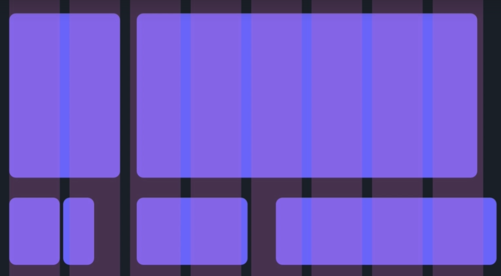

#### How to create grid guideline

* Use the same size and the same line

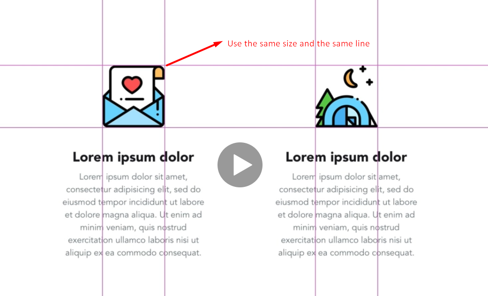

* Use text above the line

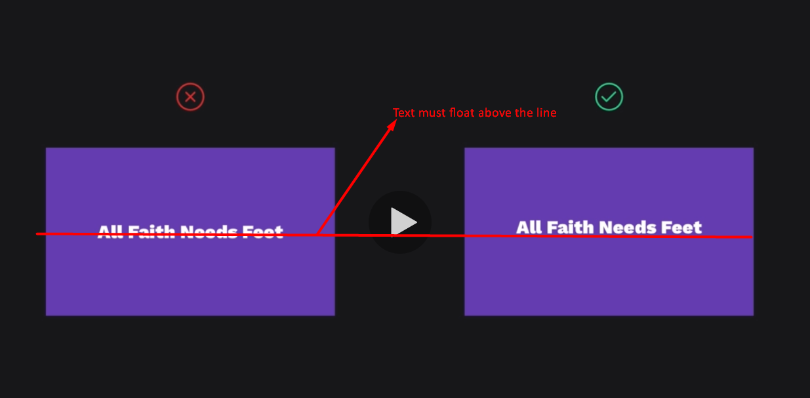

* font-style

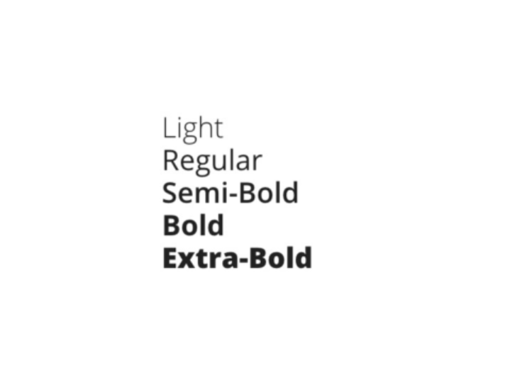

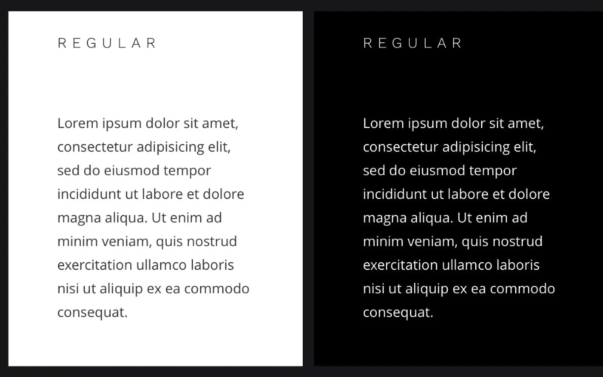

#### Layout is King

01. Alignment
02. Grid
03. Visual Hierarchy
04. Proximity

#### Typography

01. Typeface
02. Font weight
3. Font style (Regular, Ireular)
4. Font (Bold, Oblique)

#### Summary

01. Letter spacing
02. Line-height
03. Font weight

> Whenever I write a code or choose the design I have to answer myself.  
> **Example**  
> > Why I write code this one   
> > Why I choose that.   
> I must explain for everything and must have a reason   

### Colors

01. Choose colors like a pro
02. saturation  

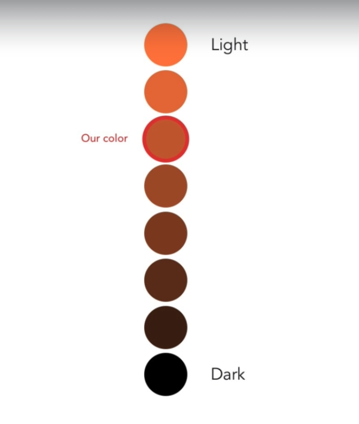

03. Select the colors from the background.  

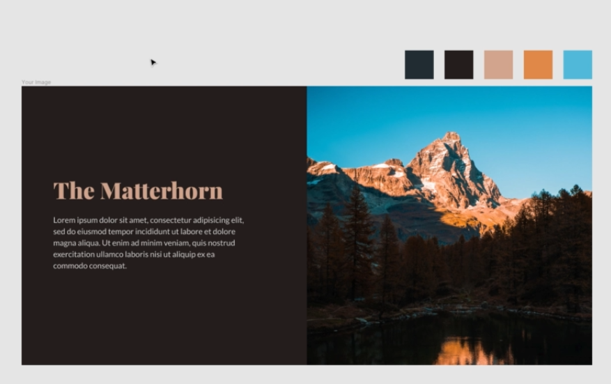

04. Image Overlays  

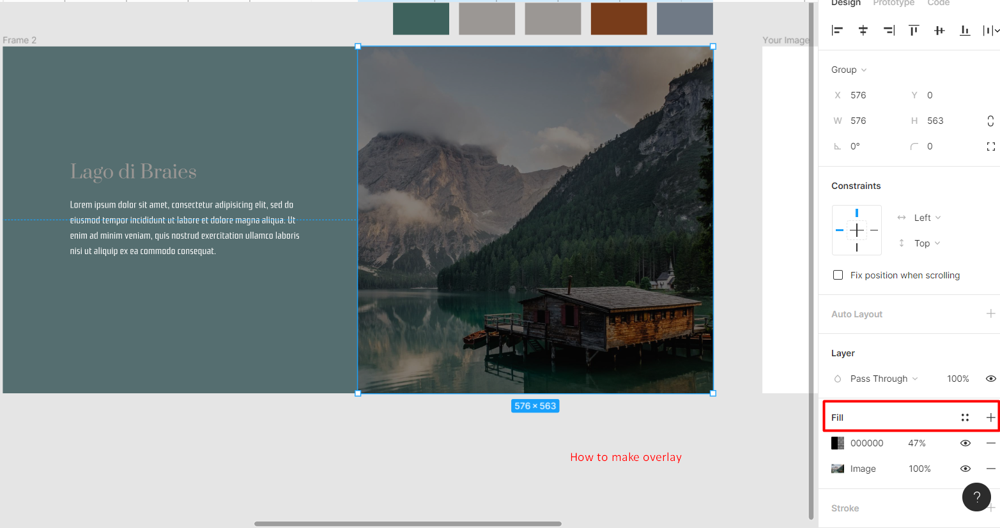

05. Image crop
  + Exterm crop
  + Soft crop
  + color crop

The beautiful hero section. You just konw how to make it and practice a lot.  

* use the good picture
* use image crop
* use typeface like a pro 

> Don't ruin your design with a bad photo.

06. The design trick
  + Used strongly in this composition is called contrast.
    - colors
    - size
    - weight
  + Whtie space
  + Overlap

07. Tension

Ref : Lecture [tension](https://www.udemy.com/course/freelance-web-design-from-design-to-development-to-making-money/learn/lecture/17941492#overview)  

08. Brand style guide  

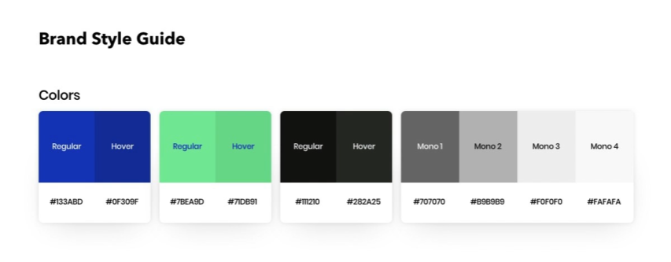

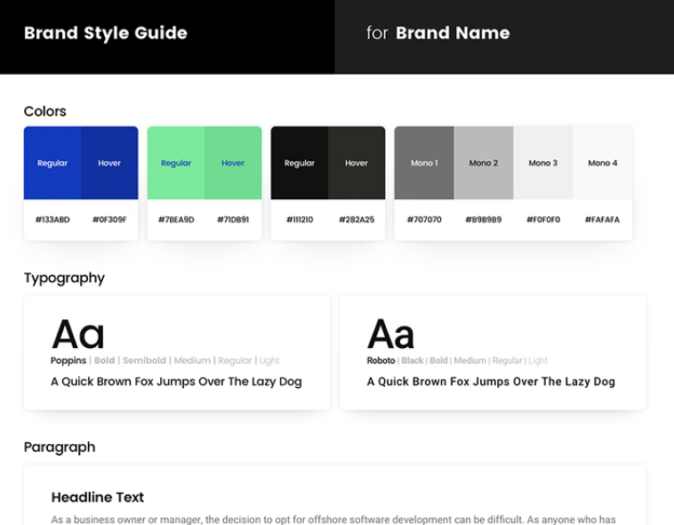

Ref : Lecture [consistency](https://www.udemy.com/course/freelance-web-design-from-design-to-development-to-making-money/learn/lecture/17941580#overview)  

09. Mimic method

Before design website I must learn about the principles of the art and practice these 3 steps  

[Link learn in Udemy](https://www.udemy.com/course/freelance-web-design-from-design-to-development-to-making-money/learn/lecture/17941668#overview)
01. copy

     1. use rulers
     2. font

          01.    style
          02.    size
          03.    weight
          04.    white space
          05.    line height

     3. Pictures
     4. Button
     5. Background 
     6. colors theme design 

02.  Remix
03.  create by your own 

> Give more inspiration with a mood board

10.   Mood board

key images  
A mood board is board of my inspiration from the website that I like such as 

* coolors
* font
* design
* frames
* white spacing

### Style guides
style guides are the green print to design 

**How to make a mood board**

1.  capture a website that you really like.
2.  paste it on figma
3.  write about that picture what are your like and why??

Inspiration collection  
[Land-book](https://land-book.com/)  
[lapa-ninja](https://www.lapa.ninja/)   
[dribbble](https://dribbble.com/)  

### Deseign Practise

01. Hero page
02. Typeface
03. Colors
04. Image
05. colotrs for button

### webflow development

### Client Project

### Freelancing

### Advanced
