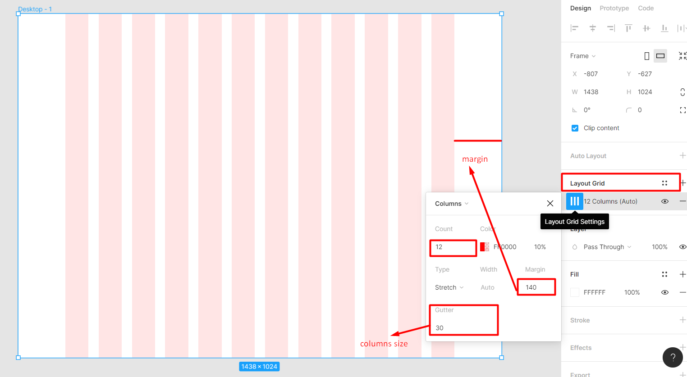

# Web Design workshop

This course I will learn about wed design and how to create my beautiful website. There are a lot of leacture and new lesson for me. This lecture very intersting

## Table of contents

- [Web Design workshop](#web-design-workshop)
  - [Table of contents](#table-of-contents)
    - [The secert of good design](#the-secert-of-good-design)
      - [Alignment](#alignment)
      - [Grid](#grid)
      - [How to create grid guideline](#how-to-create-grid-guideline)
    - [Deseign Practise](#deseign-practise)
    - [webflow development](#webflow-development)
    - [Client Project](#client-project)
    - [Freelancing](#freelancing)
    - [Advanced](#advanced)

[Sumarry for figma lectrue](https://docs.google.com/presentation/d/1njZNw-zXzvnaDuIat72FCTy-FIiOi-iSMCm18PeQ5Bw/edit?usp=sharing)

### The secert of good design

Desieng are 

1. rules 
2. techniques 
3. creativity 
4. grindline
5. Tools 

Tools  
I use [figma](https://www.figma.com/) for design and mockup my website. It is easy to use.  
I use [Webflow](https://webflow.com/) to create my website by design from figma.

#### Alignment  

#### Grid  
- Design a website with grid line that will make website clearly and attractive. Don't design sloppy at all.  
- A sample trick changed the the same design looking from clumsy to orderly and polished.
- Use whitespace to alignment box.

  

#### How to create grid guideline

### Deseign Practise

### webflow development

### Client Project

### Freelancing

### Advanced
